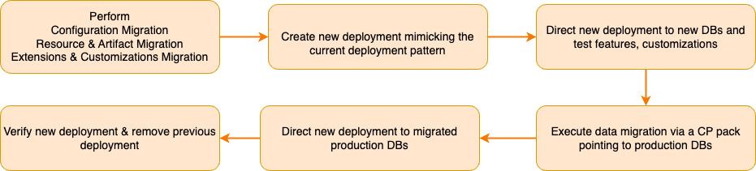

#  API-M Migration Guidelines

This section contains the general guidelines and information related to upgrading WSO2 API Manager. 
Before you upgrade your production environment, please take a moment to go through the following.

## Importance of Upgrading

There are numerous compelling reasons to consider upgrading the WSO2 API Manager to its latest version. These reasons include but are not limited to the following. 

- **New Features**: Embrace the latest version to leverage new features that enhance the overall functionality of the product.

- **Security and Bug Fixes**: Ensure the security and reliability of your system by accessing critical bug fixes and security updates available in the latest version.

- **Approaching End of Life**: If your current product version is approaching its end of life, upgrading ensures continued support and maintenance.

## Understanding API-M Migration Process

Upgrading the API-M involves four key steps, outlined below. To ensure a successful migration to the latest version, it's crucial to execute all of these steps in sequence.

1. **Configuration Migration:** This step includes transferring configurations enabled in the older version to the newer version.
2. **Extensions and Customizations Migration:** This step involves migrating customizations available in the old version to the new version.
3. **Resource and Artifact Migration:** Involves migrating various resources and artifacts from the older version of API-M to the newer one.
4. **Data Migration:** Ensures the compatibility of databases with the new APIM version.
  
## Get WSO2 Support

- **If you already have a [WSO2 Subscription](https://wso2.com/subscription)**, you can reach out to our support team through your [support account](https://support.wso2.com/jira/secure/Dashboard.jspa) to receive assistance with the migration.

-  **If you require a zero downtime migration**, you must contact WSO2 support. We do not recommend proceeding with zero downtime migration without WSO2 support. You can contact [WSO2 Support](https://support.wso2.com/jira/secure/Dashboard.jspa) for assistance.

- **If you are migrating API-M from a version older than 3.2.0**, contact the WSO2 Support Team to obtain instructions further instructions.

- **If you are migrating IS as KM from a version older than 5.10.0** contact the WSO2 Support Team to obtain instructions further instructions.

   
## Planning the Upgrade

1.  Always plan to migrate to the [latest version](https://wso2.com/api-management/) as the latest fixes and new features are available in the latest version. If you already have a [WSO2 subscription](https://wso2.com/subscription), you can use the Update Management Tool(UMT) to get any fixes or latest updates for this release. If you have a particular requirement to migrate to an intermediate version, contact [WSO2 Support](https://support.wso2.com/jira/secure/Dashboard.jspa).

    ---
    **Note** - Migrating the production environment requires additional hardware/VM resources because both the old environment and the new environment will be running until all the traffic is routed to the new environment.

    ---

2. List down the functional and non-functional use cases in your deployment and create test cases for them. This step is crucial to verify that the migrated environment works as expected.
    
3. Once you have completed all the steps up to data migration, before initiating the data migration process, it is recommended to undertake the following steps:

   - Firstly, create a deployment using the new API-M version, similar to your current deployment. 
   - Direct this deployment to a new test database that supports the new API-M version.
   - Then, conduct thorough testing of the new API-M functionalities alongside your configurations and customizations (excluding your data).
   - Once you have verified that all functionalities operate as expected, you may proceed with the data migration.
   - Following the completion of data migration, redirect the new deployment to your migrated data source as the last step.


   


4.  Start the migration from the lowest environment (e.g., dev) and continue up to the highest before the production (e.g., pre-prod). Run the test cases in the migrated environments to confirm that your functional and non-functional requirements are met in the migrated environment.
   
5.  Before you carry out the production migration, run a pilot migration on your pre-prod environment. 

    - It will be ideal if the pre-prod environment is similar to the production environment.

      -  If possible, restore a database dump of the production environment to the pre-prod environment and perform the pilot migration.

      -  If the production database dump cannot be used, at least ensure that you have a sufficient amount of data in the database to mimic the production environment.

6. When you follow the above instructions, you can get a rough estimate of the time for the final production update, and you can allocate time slots based on the above analysis. WSO2 recommends that you perform the migration while the system is under minimum traffic. 
   
7. After you have completed the above instructions and are satisfied with the outcome, proceed with the production migration process. After the migration is complete, verify the migration process using the following instructions.
    
   -  Monitor the system health (CPU, memory usage, etc.).
   -  Monitor the WSO2 logs for errors.

## Required Skill Set and Available Training

<!-- TODO: Add More Content -->
For more information about available training, please refer https://wso2.com/training/

## Migration Catalog Structure

Once you have gone through the above, you can proceed with the migration by referring to the version specific migration documents in the migration catalog. The structure of the migration catalog is as follows, and please refer to the documents in the order given within the brackets.

```
├── migration-catalog
│   ├── upgrading-to-apim-4xx
│   |   ├── version-specific-guidelines.md (1)
│   │   ├── upgrading-from-3xx-to-4xx
│   |   │   ├── upgrading-from-3xx-to-4xx.md (2)
│   |   │   ├── config-migration.md (3)
│   |   │   ├── resource-and-artifact-migration.md (4)
│   |   │   ├── extensions-and-customizations-migration.md (5)
│   |   │   ├── data-migration.md (6)
│   |   │   ├── server-startup-actions.md (7)
```
